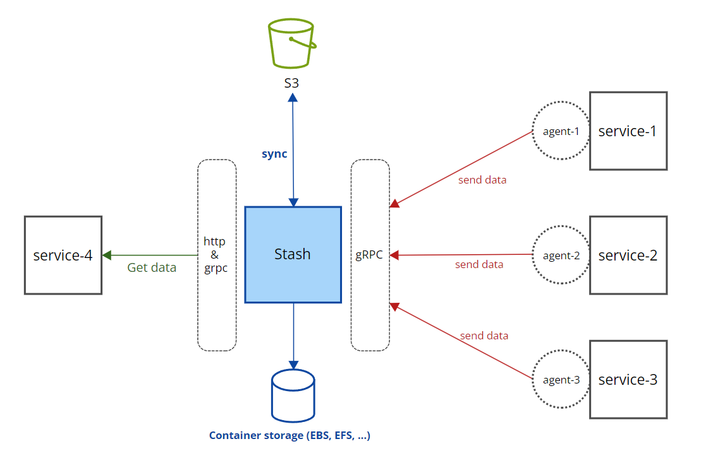

<p align="center">
	<a href="https://github.com/tiangolo/fastapi/actions?query=workflow%3ATest+event%3Apush+branch%3Amaster" target="_blank">
			
	</a>
	<a href="https://fastapi.tiangolo.com"></a>
	<a href="https://fastapi.tiangolo.com"></a>
	<a></a>
</p>


---
Go Agent Stash is a simple service receive logs from agents - save logs in to filesystem - sync logs to AWS S3

The key features are:
* **Fast transport gRPC**: Using gRPC protocol for fast transfer data between internal service of microservice system.
* **Gateway proxy**: Support gRPC Gateway Proxy to optional get data back by RESTful API or gRPC.
* **Schedule jobs**: Can setup schedule jobs to sync data to S3, clean local file system.
* **Support Docker & Kubernestes**: You can easy deploy own system with script.

## Architecture



---

## Requirements
Golang 1.20

## Installation

```console
edit .env.example

make server

---> Your service will start in port=8080(http) & port=9090(gRPC) 
```

You can easy deploy to you Kubernetes

```console
export KUBE_CONFIG=<You-.kube-config>

kubectl apply -f k8s/
```

---

## Owner

<table>
  <tr>
    <td align="center"><a href="https://github.com/anthoai97"><br /><sub><b>An Thoai</b></sub></a><br /></td>
    </tr>
</table>

---

## License

This project is licensed under the terms of the MIT license.